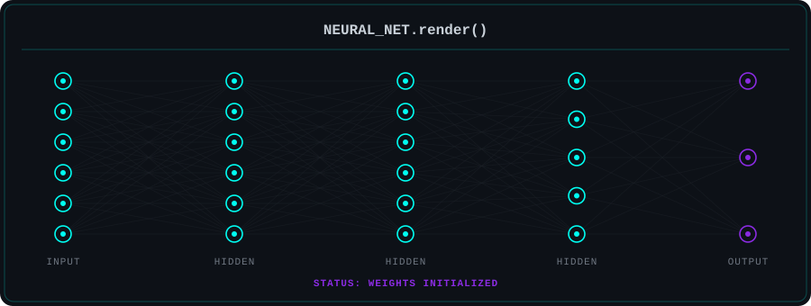

<div align="center">

<!-- ═══════════════════════════════════════════════════════ -->
<!-- SECTION 1 — ANIMATED HERO -->
<!-- ═══════════════════════════════════════════════════════ -->


<a href="https://git.io/typing-svg">
  
</a>

<br/>


<br/><br/>

`STATUS: ONLINE` ▸ `CORE: AI/ML` ▸ `LOCATION: INDIA 🇮🇳` ▸ `UPTIME: 20 Years`

</div>

<br/>

<!-- ═══════════════════════════════════════════════════════ -->
<!-- SECTION 2 — AI RESEARCH TERMINAL (NEOFETCH STYLE) -->
<!-- ═══════════════════════════════════════════════════════ -->

```
┌──────────────────────────────────────────────────────────────────────────┐
│  omar@jmi-ai:~$ ./boot_profile.sh                                        │
└──────────────────────────────────────────────────────────────────────────┘
```

<table>
<tr>
<td width="50%" valign="top">



</td>
<td width="50%" valign="top">



</td>
</tr>
</table>

<br/>

<!-- ═══════════════════════════════════════════════════════ -->
<!-- SECTION 3 — SYSTEM BOOT SEQUENCE -->
<!-- ═══════════════════════════════════════════════════════ -->

<div align="center">

</div>

<br/>

<!-- ═══════════════════════════════════════════════════════ -->
<!-- SECTION 4 — TECH STACK DASHBOARD -->
<!-- ═══════════════════════════════════════════════════════ -->

## `$ cat tech_stack.dashboard`

<div align="center">

**// PROGRAMMING**


**// AI & MACHINE LEARNING**


**// DATA SCIENCE**


**// TOOLING & INFRA**


</div>

<br/>

<!-- ═══════════════════════════════════════════════════════ -->
<!-- SECTION 5 — AI LAB STATUS -->
<!-- ═══════════════════════════════════════════════════════ -->

## `$ ./lab_status --verbose`

<div align="center">

</div>

<br/>

<!-- ═══════════════════════════════════════════════════════ -->
<!-- SECTION 6 — GITHUB ANALYTICS -->
<!-- ═══════════════════════════════════════════════════════ -->

## `$ ./run_analytics.sh`

<div align="center">


<br/>


<br/>


<br/><br/>


</div>

<br/>

<!-- ═══════════════════════════════════════════════════════ -->
<!-- SECTION 7 — CURRENT RESEARCH -->
<!-- ═══════════════════════════════════════════════════════ -->

## `$ cat research/current_focus.md`

```
┌─ RESEARCH TOPICS ─────────────────────────────┐
│                                                │
│  ▸ Large Language Models                      │
│  ▸ Agentic AI Systems                         │
│  ▸ Retrieval Augmented Generation (RAG)       │
│  ▸ Deep Learning Architectures                │
│  ▸ Explainable AI (XAI)                       │
│  ▸ Data Science Applications                  │
│                                                │
└────────────────────────────────────────────────┘
```

<br/>

<!-- ═══════════════════════════════════════════════════════ -->
<!-- SECTION 8 — PROJECT PIPELINE -->
<!-- ═══════════════════════════════════════════════════════ -->

## `$ ./pipeline --status`

```
[ACTIVE]
┣━━ 🧠 AI Projects
┣━━ 📊 Data Science Experiments
┣━━ 🌱 Open Source Learning
┗━━ 📂 Research Portfolio

[NEXT]
┣━━ 🔎 RAG Applications
┣━━ 🚀 Model Deployment
┗━━ 🤖 AI Agents
```

<br/>

<!-- ═══════════════════════════════════════════════════════ -->
<!-- SECTION 9 — ACHIEVEMENTS DASHBOARD -->
<!-- ═══════════════════════════════════════════════════════ -->

## `$ ./achievements --list`

<div align="center">

| 🎓 Certifications | 🔬 Research | 🏆 Hackathons | 🌐 Open Source | ✍️ Blogs |
|:---:|:---:|:---:|:---:|:---:|
| Google × Kaggle 5-Day AI Agents Intensive (Vibe Coding, 2026) | Faculty outreach @ JMI — ML/NLP labs | Kaggle "Agents for Good" — Heart Disease Risk Multi-Agent System (Google ADK + MCP) | `student-performance-analyser` | *Coming soon* |
| Andrew Ng Deep Learning Specialization *(in progress)* | Cold-email pipeline to Dr. M. Z. Ansari & Prof. S. Masood | IMC Prosperity — prep in progress | `backtest-desk` · `DSA` | *Medium articles planned* |

</div>

<br/>

<!-- ═══════════════════════════════════════════════════════ -->
<!-- SECTION 10 — CONNECT TERMINAL -->
<!-- ═══════════════════════════════════════════════════════ -->

## `$ ./connect.sh`

<div align="center">

```bash
guest@jmi-ai:~$ connect --github
```
<a href="https://github.com/omar-dev6002"></a>

```bash
guest@jmi-ai:~$ connect --linkedin
```
<a href="https://linkedin.com/in/omar-farooq-anis-b2798a382"></a>

```bash
guest@jmi-ai:~$ connect --email
```
<a href="mailto:omarfarooqanis1982@outlook.com"></a>
<a href="mailto:omarfarooqanis6002@gmail.com"></a>

```bash
guest@jmi-ai:~$ connect --portfolio
```
<a href="https://your-portfolio-url.com"></a>

</div>

<br/>

<!-- ═══════════════════════════════════════════════════════ -->
<!-- SECTION 11 — CONTRIBUTION SNAKE -->
<!-- ═══════════════════════════════════════════════════════ -->

## `$ ./run contribution_snake.exe`

<div align="center">

</div>

> ⚙️ **Setup required (one-time):** the snake image only appears once you add the workflow file below to this same repo at `.github/workflows/snake.yml`. GitHub Actions will then generate `github-contribution-grid-snake-dark.svg` automatically every 24h.

<br/>

<!-- ═══════════════════════════════════════════════════════ -->
<!-- SECTION 12 — FOOTER -->
<!-- ═══════════════════════════════════════════════════════ -->

<div align="center">

```python
while(alive):
    learn()
    build()
    share()
    improve()
```


**"The neural network of the mind grows strongest through iteration, not perfection."**

`— omar@jmi-ai:~$ shutdown -r "see you in the next commit"`

</div>
